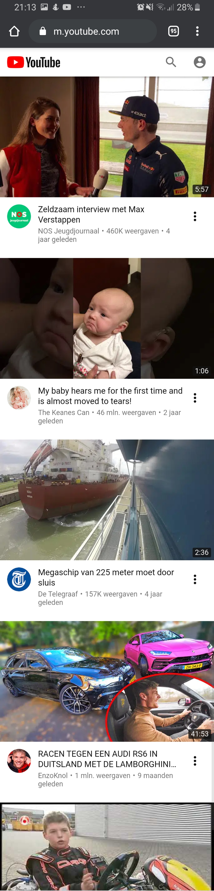
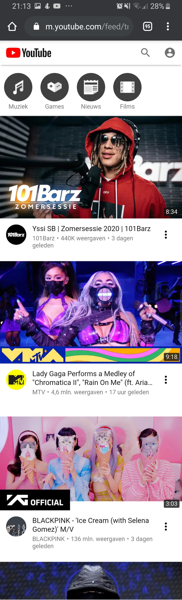
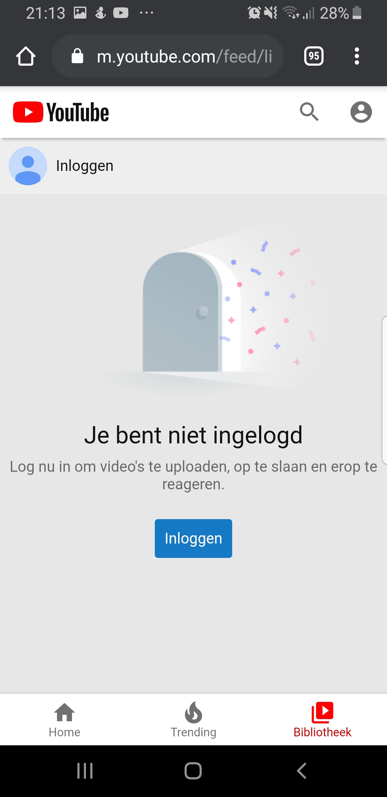
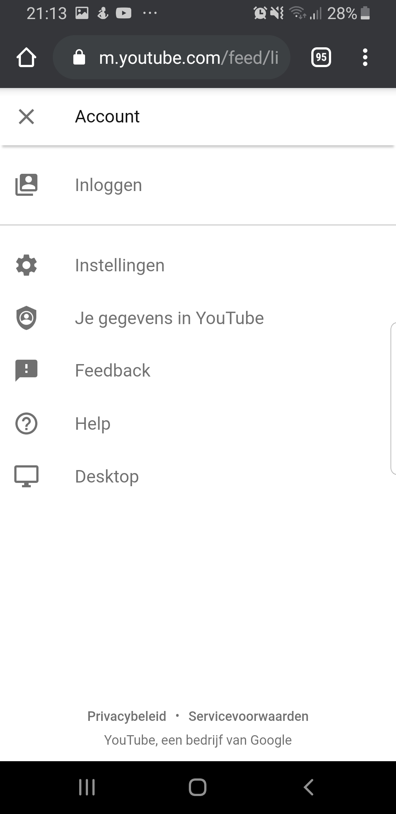
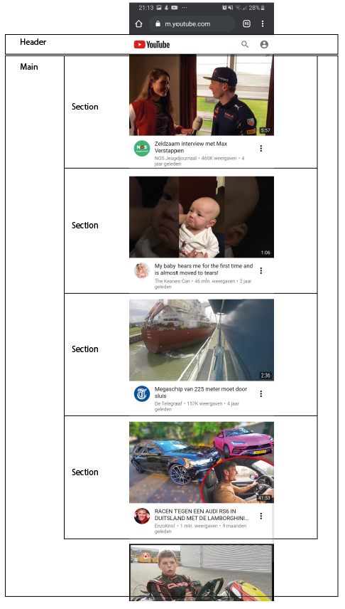
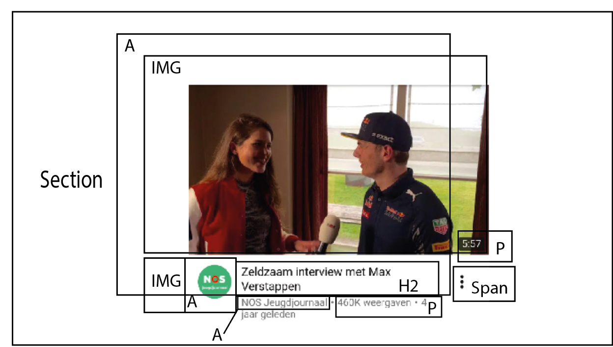
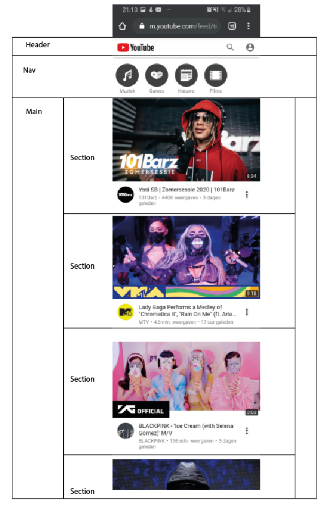
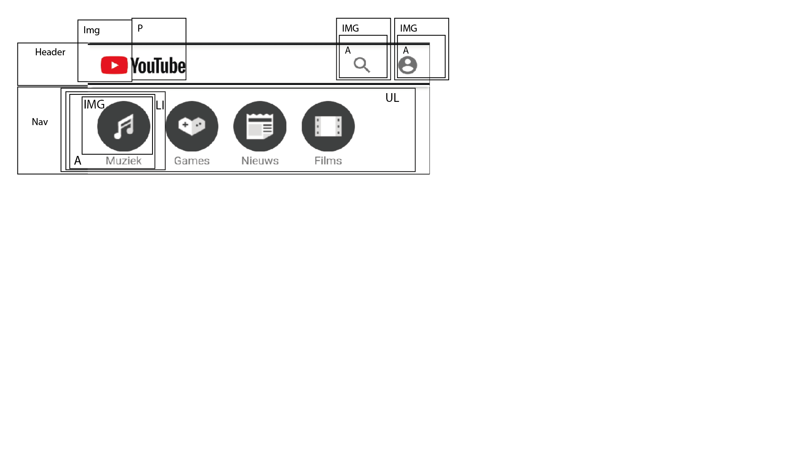

# Procesverslag
**Auteur:** -Bas Vugts-

Markdown cheat cheet: [Hulp bij het schrijven van Markdown](https://github.com/adam-p/markdown-here/wiki/Markdown-Cheatsheet). Nb. de standaardstructuur en de spartaanse opmaak zijn helemaal prima. Het gaat om de inhoud van je procesverslag. Besteedt de tijd voor pracht en praal aan je website.

## Bronnenlijst

1. https://www.vpra.nl/wp-content/uploads/2018/05/Telegraaf-logo-e1525863077791.jpg (logo telegraaf)
2. https://www.youtube.com (thumbnails van de video's)
3. https://yt3.ggpht.com/a/AATXAJzEG8vQEjyzCsugKY-Kp-aMD7ocKAgjV8e_EFfMkw=s900-c-k-c0xffffffff-no-rj-mo (jeugdjournaal logo)
4. https://yt3.ggpht.com/a/AATXAJxmq8ive1aZb-ytQhSvJYgEq0hDs4HXXj9gEL6c0Q=s100-c-k-c0xffffffff-no-rj-mo (enzo knol logo)
5. https://yt3.ggpht.com/a/AATXAJzk27R2HIarflCB5oO7Nb3rBwmiWw4iiefpw_6ncg=s144-c-k-c0xffffffff-no-rj-mo (my baby is hearing me logo)
6. https://seeklogo.com/vector-logo/316124/youtube-2017 (youtube logo)
7. https://stackoverflow.com/questions/26973570/setting-a-max-character-length-in-css (truncating text)

## Eindgesprek (week 7/8)

-dit ging goed & dit was lastig-

**Screenshot(s):**

-screenshot(s) van je eindresultaat-

## Voortgang 3 (week 6)

-same as voortgang 1-

## Voortgang 2 (week 5)

-same as voortgang 1-

## Voortgang 1 (week 3)

### Stand van zaken

-dit ging goed & dit was lastig-

**Screenshot(s):**

-screenshot(s) van hoe ver je bent-

### Agenda voor meeting

-samen met je groepje opstellen-

### Verslag van meeting

-na afloop snel uitkomsten vastleggen-

## Intake (week 1)

**Je startniveau:** -kies uit zwart, rood óf blauw-
Mijn start niveau is rood.

**Je focus:** -kies uit responsive óf surface plane-
Ik wil mij graag focussen op responsive

**Je opdracht:** -link naar de website die je gaat namaken óf de naam van je eigen ontwerp-
www.youtube.com

**Screenshot(s):**

 
 
 
 

**Breakdown-schets(en):**

