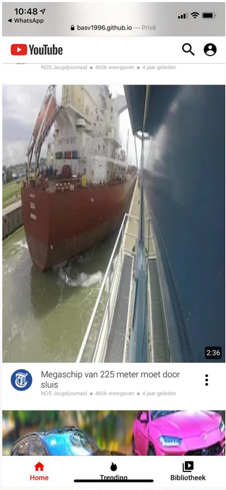
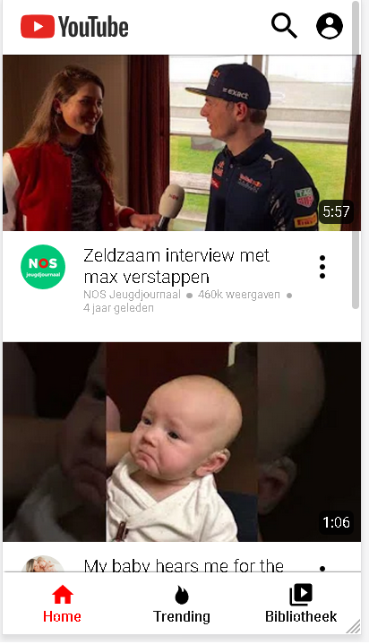

# Procesverslag
**Auteur:** -Bas Vugts-

Markdown cheat cheet: [Hulp bij het schrijven van Markdown](https://github.com/adam-p/markdown-here/wiki/Markdown-Cheatsheet). Nb. de standaardstructuur en de spartaanse opmaak zijn helemaal prima. Het gaat om de inhoud van je procesverslag. Besteedt de tijd voor pracht en praal aan je website.

## Bronnenlijst

1. https://www.vpra.nl/wp-content/uploads/2018/05/Telegraaf-logo-e1525863077791.jpg (logo telegraaf)
2. https://www.youtube.com (thumbnails van de video's)
3. https://yt3.ggpht.com/a/AATXAJzEG8vQEjyzCsugKY-Kp-aMD7ocKAgjV8e_EFfMkw=s900-c-k-c0xffffffff-no-rj-mo (jeugdjournaal logo)
4. https://yt3.ggpht.com/a/AATXAJxmq8ive1aZb-ytQhSvJYgEq0hDs4HXXj9gEL6c0Q=s100-c-k-c0xffffffff-no-rj-mo (enzo knol logo)
5. https://yt3.ggpht.com/a/AATXAJzk27R2HIarflCB5oO7Nb3rBwmiWw4iiefpw_6ncg=s144-c-k-c0xffffffff-no-rj-mo (my baby is hearing me logo)
6. https://seeklogo.com/vector-logo/316124/youtube-2017 (youtube logo)
7. https://stackoverflow.com/questions/26973570/setting-a-max-character-length-in-css (truncating text)
8. https://s.ytimg.com/yts/img/favicon_96-vflW9Ec0w.png (favicon YouTube)
9. https://www.iconfinder.com/icons/3688488/burn_camping_fire_fireplace_flame_hot_light_trend_trending_icon (trending icon)
9. https://www.iconfinder.com/icons/3669170/home_ic_icon (Home Icon)
10. https://www.iconfinder.com/icons/3669182/ic_library_video_icon (library icon)
11. https://cdn4.iconfinder.com/data/icons/game-10/22/player-profile-256.png (profile icon)
12. https://www.iconfinder.com/icons/326690/magnify_search_zoom_icon (search icon)
13. https://www.youtube.com/watch?v=KyBmo_VffWI (how to fill svg color)
14. https://stackoverflow.com/questions/7648898/how-to-get-rid-of-blue-outer-border-when-clicking-on-a-form-input-field/7648930 (remove outline input )
15. https://stackoverflow.com/questions/57516373/image-stretching-in-flexbox-in-safari (image stretching on iphones)
16: https://developer.mozilla.org/en-US/docs/Web/Accessibility/ARIA/ARIA_Techniques/Using_the_aria-hidden_attribute (aria hidden)
17: https://m.youtube.com/static/sign_in_promo.png (sign in image)
18: https://www.flaticon.com/free-icon/left-arrow_2089649?term=arrow%20left&page=1&position=62 (left arrow)

## Eindgesprek (week 7/8)

-dit ging goed & dit was lastig-

**Screenshot(s):**

-screenshot(s) van je eindresultaat-

## Voortgang 3 (week 6)

-same as voortgang 1-

## Voortgang 2 (week 5)

### Stand van zaken

-dit ging goed & dit was lastig-

Ging goed:
-Ik heb extra javascript en media queries toegevoegd aan m'n website en ben begonnen aan de 2e pagina. Ik heb de profile menu erbij gemaakt, tevens, met hulp van de docent, ervoor gezorgd dat m'n javascript code voor het actief maken van de footer sections er mooier uitzag. Hiervoor had ik eerst 3 verschillende functies die bijna identiek aan elkaar waren.

Ging lastig:
- Javascript code voor de class actief weg te halen van alle sections in de footer behalve de section waarop geklikt was.

###agenda vor meeting
| Mirna                      | Rikkert                   | Bas                          | Sophie |
| -------------              |:-------------:            | -----:                       | -----:                                 |
|  correcte code checken     | flex-box dingetje         |  Is de tweede pagina genoeg? | Wanneer wel/niet div'jes  |
|  flex-box dingetje         |   Tweede pagina meer info |                              | moeten de img op knopjes met background-image|
| Hoe krijgen we pluspunten? |                           |                              | Hoever moet filters uitgewerkt worden? |

## Voortgang 1 (week 3)

### Stand van zaken

-dit ging goed & dit was lastig-

Ging goed:
-bijna elke dag eventjes aan front-end gezeten en de oplossingen van de opdrachten toe kunnen passen in m'n eigen code.

Ging lastig:
- flexbox is nog een beetje lastig voor mij aangezien ik hier geen ervaring mee heb.

- Ook lukt het mij wel om javascript te schrijven alleen het netjes te maken gaat lastig.

- Ik ben er achter gekomen dat mijn code niet goed werkt op apple apparaten. Hierdoor is de thumbnail van youtube gestretcht. Ik wil dit nog gaan bekijken hoe ik dit kan oplossen.
 

**Screenshot(s):**

-screenshot(s) van hoe ver je bent-
 

### Agenda voor meeting

Wij willen graag als groepje de volgende dingen bespreken met de student assistent:

1: Semantisch correcte code (15 min) (Uitleg)
2: Javascript               (30 min) (opdrachten bekijken)
3: CSS                      (15 min) (uitleg)

### Verslag van meeting

Samen met de student assistenten hebben we gekeken naar onze code en of deze sematisch correct was. Zei hebben ons geholpen en uitleg gegeven over media queries.

Hierna hebben we de opdrachten van FED met de javascript opdrachten samen bekeken.
Hier hebben zij samen met ons de opdracht met de shoppingcart uitgelegd.
Tevens hebben zij ons een tip gegeven dat we eerst psuedo code moeten schrijven in het nederlands en deze moeten omzetten naar javascript.

Je mag wel div's gebruiken maar gebruik ze niet voor elementen waar al een HTML5 element voor is. Als je bij je eindgesprek kan uitleggen waarom je een div hebt gebruik (bijvoorbeeld om2 elementen een display flex te geven) dan is dat ook goed.

We hebben met z'n alle naar de code van 1 van de teamleden bekeken. Dit was omdat diegene ergens niet uit kwam. 1 van de student assistenten heeft toen laten zien hoe je d.m.v. met firefox kan debuggen. Dit doe je namelijk door de css als het ware "uit te vinken" in de editor.

tip: voeg leuke of grappige animaties toe met css (als je je avontuurlijk voelt ook JavaScript) om de docenten te verrassen.

## Intake (week 1)

**Je startniveau:** -kies uit zwart, rood óf blauw-
Mijn start niveau is rood.

**Je focus:** -kies uit responsive óf surface plane-
Ik wil mij graag focussen op responsive

**Je opdracht:** -link naar de website die je gaat namaken óf de naam van je eigen ontwerp-
www.youtube.com

**Screenshot(s):**

 
 
 
 

**Breakdown-schets(en):**

